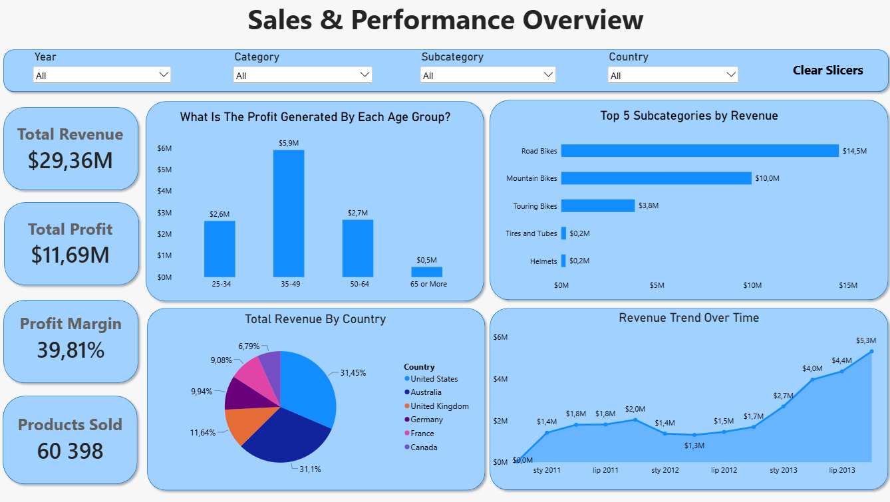
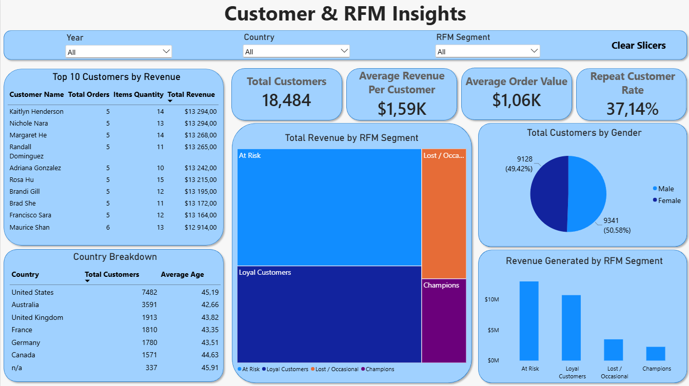

# 📊 End-to-End SQL Data Warehouse & Power BI Analytics

## 📋 Project Overview & Tech Stack
This project showcases a complete business intelligence pipeline, converting raw, fragmented e-commerce transactional data into a structured data warehouse and an interactive visual analytics solution.

* **SQL Server:** ETL process implementation, data cleansing (Silver Layer), and Star Schema business modeling (Gold Layer).
* **Power BI Desktop:** Relational data modeling, DAX measures, RFM segmentation, and visual dashboard design.
* **DAX (Data Analysis Expressions):** Simple logic for customer KPIs

---

## 1. Business Question
How can an enterprise transform raw transactional database records into a structured SQL Data Warehouse and an interactive Power BI dashboard to track global financial performance and segment customers (RFM) for targeted growth strategies?

---

## 2. Answer
By engineering a multi-layer **SQL Data Warehouse (Silver & Gold Layers)** and connecting it to an interactive **2-page Power BI Dashboard**:
* **Financial Performance:** Achieved $29.36M in Total Revenue and $11.69M in Total Profit (39.81% Margin). The **35–49 age group** emerged as the core revenue driver ($5.9M profit), with **Road Bikes** generating the majority of sales ($14.5M).
* **Customer Retention:** Identified that while the overall Repeat Customer Rate stands at **37.14%**, a significant portion of customers falls into the **At Risk** segment, providing actionable insights for marketing retention workflows.

### 🖼️ Power BI Dashboard Overview

#### Page 1: Sales & Performance Overview 

 

#### Page 2: Customer & RFM Insights

---

## 3. Dataset Explanation
The solution uses a relational transactional dataset processed through an End-to-End ETL pipeline:

* **Bronze Layer (Raw):** Ingestion of raw transactional SQL data covering sales orders, products, customers, and sales territories.
* **Silver Layer (Cleaned & Normalized):** SQL scripts applied to clean missing values, normalize formats, and standardize fields.
* **Gold Layer (Star Schema / Views):** Optimized business views (`gold.fact_sales`, `gold.dim_customers`, `gold.dim_products`) serving as the single source of truth for reporting.

---

## 4. Analysis Walkthrough

### 🛠️ Data Architecture & Pipeline Implementation
The project implements an end-to-end data pipeline moving from raw source ingestion to visual business intelligence:

* **Data Architecture:** Designed a enterprise Data Warehouse leveraging the **Medallion Architecture** (Bronze, Silver, and Gold layers) to enforce data quality and separation of concerns.
* **ETL Pipelines:** Built robust SQL extraction, transformation, and loading logic to clean, format, and load raw source data into structured warehouse tables.
* **Data Modeling:** Modeled an optimized **Star Schema** in the Gold layer, establishing clear relationships between core Fact tables (`fact_sales`) and Dimension tables (`dim_customers`, `dim_products`).
* **Data Analytics & Exploration:** Authored a comprehensive suite of **SQL scripts** for ad-hoc data exploration, descriptive analytics, business metric validation, and auditing before connecting to the BI layer.
